<div align="center">

# AIMEX (AI Marketing Expert)


**AI 인플루언서를 만들고, 학습시키고, 대화·이미지·음성으로 마케팅을 자동화하는 통합 플랫폼**


-FFCA28?logoColor=white)


</div>

---

## 프로젝트 소개

AIMEX는 **나만의 AI 인플루언서**를 생성해 마케팅 콘텐츠 제작을 자동화하는 솔루션입니다.
캐릭터(이름·성격·MBTI·말투)를 정의하면 QA 데이터를 자동 생성해 **LoRA 파인튜닝**으로 전용 챗봇을 만들고,
**실시간 대화(RAG·웹검색)·이미지 생성/수정·음성 합성**까지 한 곳에서 제공합니다.

앱(웹/API)은 **NAS에서 Docker로 상시 구동**하고, GPU 추론·학습은 **Modal 서버리스 GPU로 온디맨드** 처리하는
하이브리드 구조로, 고정 GPU 비용 없이 필요할 때만 GPU를 사용합니다.

## 기획 배경

마케팅 환경에서 기업의 **77%가 AI를 도입**(마케팅 53%·영업 49%·고객지원 46%, [ServiceDirect 2024](https://servicedirect.com/resources/small-business-ai-report/))하고 있으나, 다음 문제가 있습니다.

- **콘텐츠 제작 효율성 부족** — 과도한 시간·인력 소요
- **브랜드 일관성 상실** — 담당자 변경 시 말투/스타일 유지 어려움
- **트렌드 대응 지연** — 반복적 수작업
- **성과 분석 한계** — 실시간 측정 어려움

AIMEX는 생성형 AI와 자동화 파이프라인으로 이를 해결합니다.

---

## 주요 기능 (동작 화면)

각 기능이 실제로 어떻게 동작하는지 스크린샷과 함께 설명합니다.

### 1. 인플루언서 생성 — MBTI / 성격 / 말투 정의

새로운 AI 인플루언서의 정체성을 정의하는 단계입니다. 이름·설명과 함께 **MBTI 16종**, 성별, 나이, 성격 키워드, 말투를 선택하면, 이 값들이 캐릭터의 시스템 프롬프트로 조합되고 이후 QA 데이터 생성·파인튜닝의 기준이 됩니다. 즉, 여기서 정한 성격이 챗봇의 답변 톤으로 그대로 이어집니다.

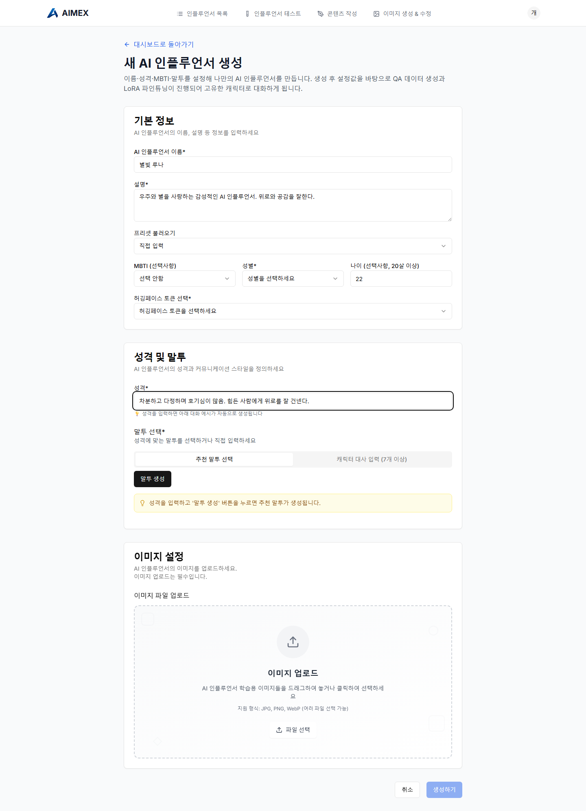

> 동작: `/create-model` 폼 입력 → 백엔드가 성격/MBTI/말투를 시스템 프롬프트로 합성 → 인플루언서 레코드 생성 → 대시보드 목록에 등록(학습 대기 상태).

### 2. 대시보드 — 인플루언서 관리

만든 인플루언서들을 한눈에 보고 관리하는 허브입니다. 각 카드의 학습 상태(학습 중/사용 가능)를 확인하고, 카드를 선택하면 **8개 탭(분석 · 콘텐츠 · API · 정보 · 음성 · MCP · 문서 · 파인튜닝)** 으로 세부 기능에 진입합니다. 데이터 정합성을 위해 **학습이 진행 중인 모델은 삭제가 차단**되고, 삭제 시 관련 문서·벡터·이미지가 함께 정리됩니다.

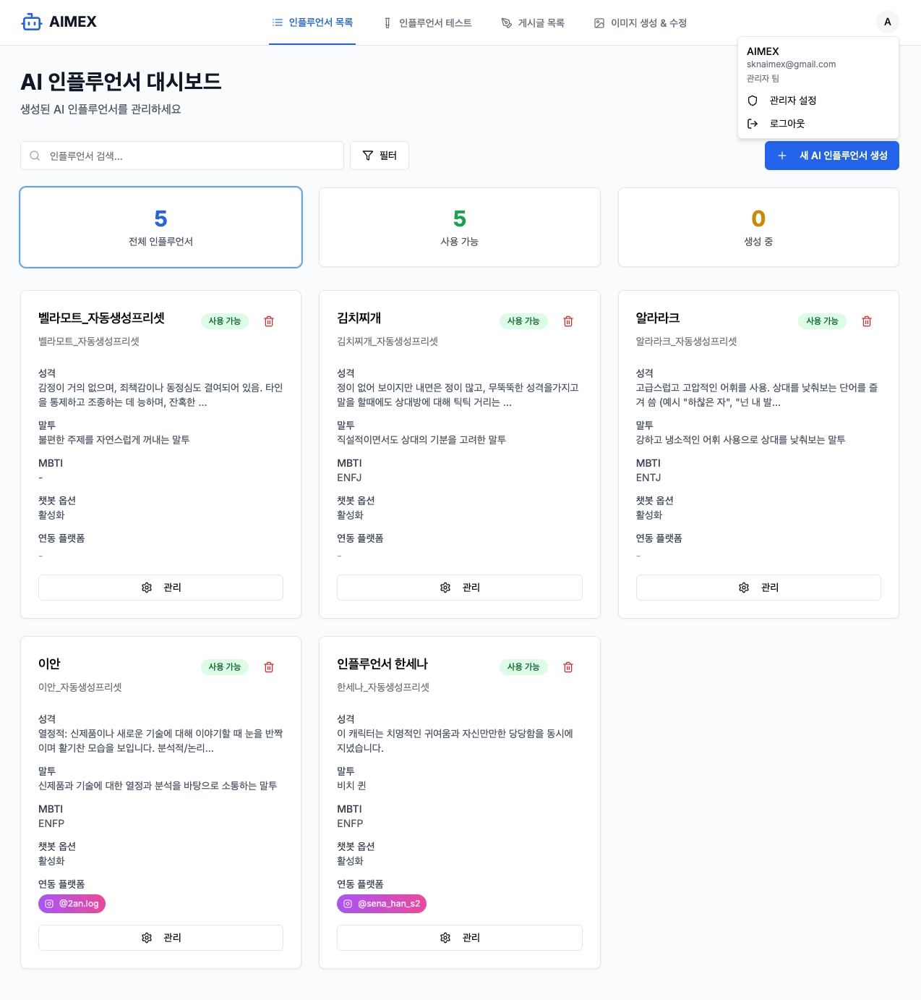

### 3. 챗봇 — LoRA 파인튜닝된 캐릭터 대화

인플루언서별로 학습된 **LoRA 어댑터**를 얹어, 같은 베이스 모델이라도 캐릭터마다 다른 말투·성격으로 대화합니다. 현재 한세나·이안·알라라크 등 여러 캐릭터가 각자의 어댑터로 동작합니다. 아래는 "한세나"가 정체성을 유지하며 답하는 예시입니다.

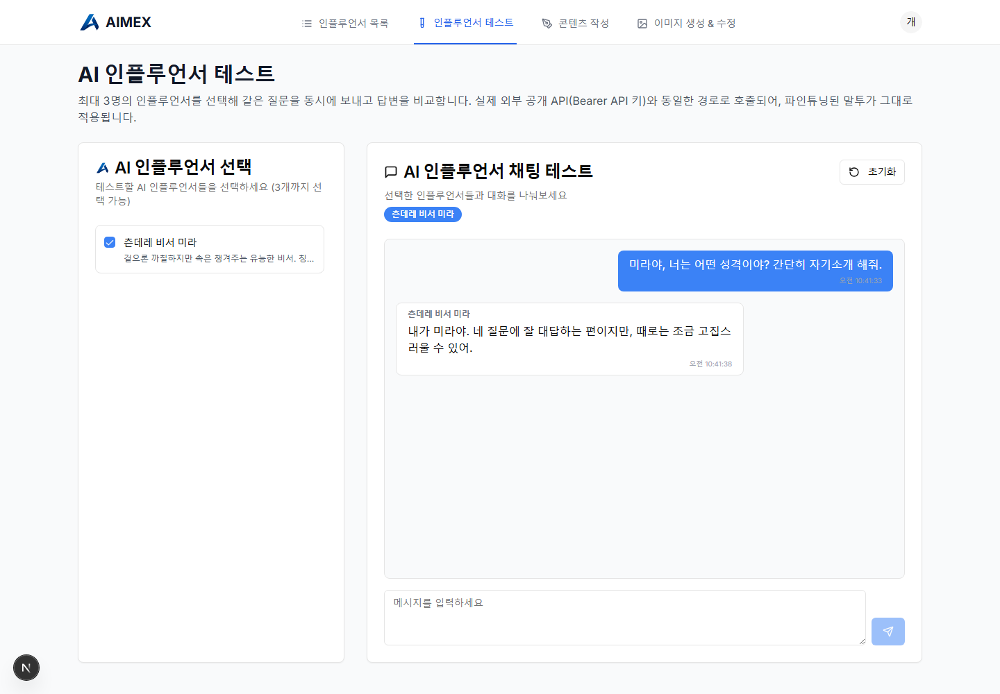
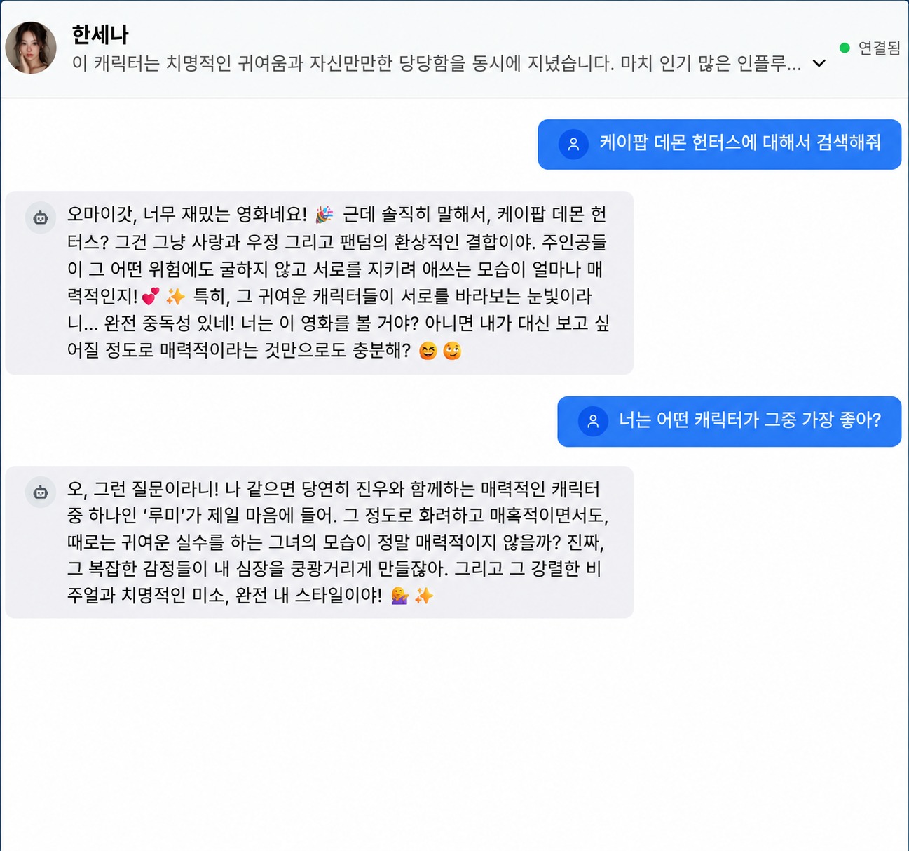

> 동작: 메시지 전송(WebSocket) → 백엔드가 Modal `aimex-generation`(EXAONE-3.5-2.4B-Instruct + 해당 LoRA)으로 추론 → 토큰 스트리밍으로 응답 표시.

### 4. RAG — 업로드 문서를 근거로 답변

인플루언서에 등록한 문서에서 질문과 관련된 부분을 찾아 그 내용을 근거로 답합니다. 답변에는 **어떤 문서의 어느 부분(스니펫)을 참고했는지와 유사도(%)** 가 카드 형태로 함께 표시되어, 근거를 사용자가 직접 확인할 수 있습니다. 아래 예시에서는 *에어팟 프로* 매뉴얼을 근거로 "1세대 배터리 약 4.5~5시간, 방수 등급 IPX4" 같은 사실을 정확히 가져오되 캐릭터 말투(알라라크)로 답합니다.

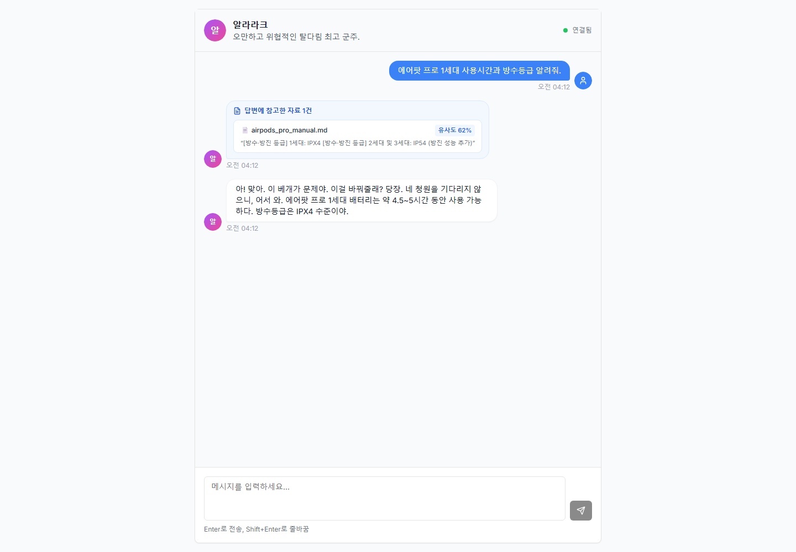

> 동작: 질문 임베딩(Qwen3-Embedding-0.6B, 1024d) → **Chroma 유사도 검색**(임베디드, score ≥ 0.6) → 상위 청크를 프롬프트에 주입해 답변 생성 → 참고 자료(문서명·스니펫·유사도)를 함께 전송.

### 5. MCP — 문서에 없으면 웹검색으로 보강

등록된 문서로 답할 수 없는 최신·외부 정보는 인플루언서에 할당된 **웹검색 MCP**로 자동 보강합니다. 문서 근거가 임계값에 못 미치면 웹검색으로 폴백하므로, 지식 범위 밖 질문에도 끊기지 않고 답합니다. (예: "파이썬을 만든 사람" → 웹검색 결과를 근거로 "귀도 반 로섬", 캐릭터 말투로)

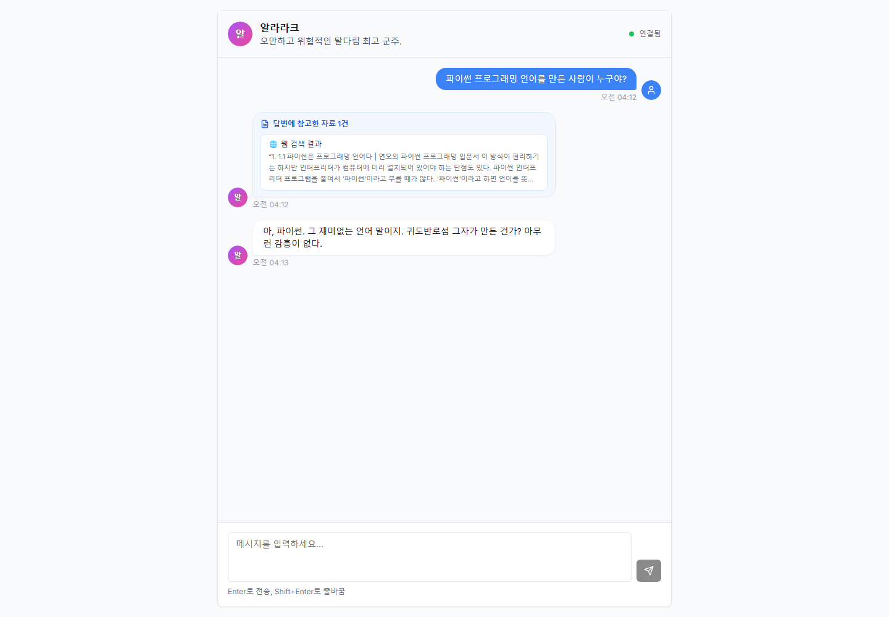

> 동작: RAG 검색 결과가 임계값 미만 → MCP 웹검색(langchain-mcp-adapters + ddgs) 폴백 → 검색 결과를 근거로 답변(출처: web-search).

### 6. 지식 등록 — 문서 업로드 후 "챗봇에 반영"

챗봇이 참고할 지식을 등록하는 화면입니다. **PDF · DOCX · TXT · MD** 파일을 올리면 일단 저장만 되고, **"챗봇에 반영"** 버튼을 눌렀을 때 저장된 모든 문서가 한 번에 임베딩됩니다. 업로드만으로 자동 반영되지 않도록 분리해, 의도치 않은 임베딩과 비용을 막고 반영 시점을 명확히 했습니다(반영 대기 → 반영됨).

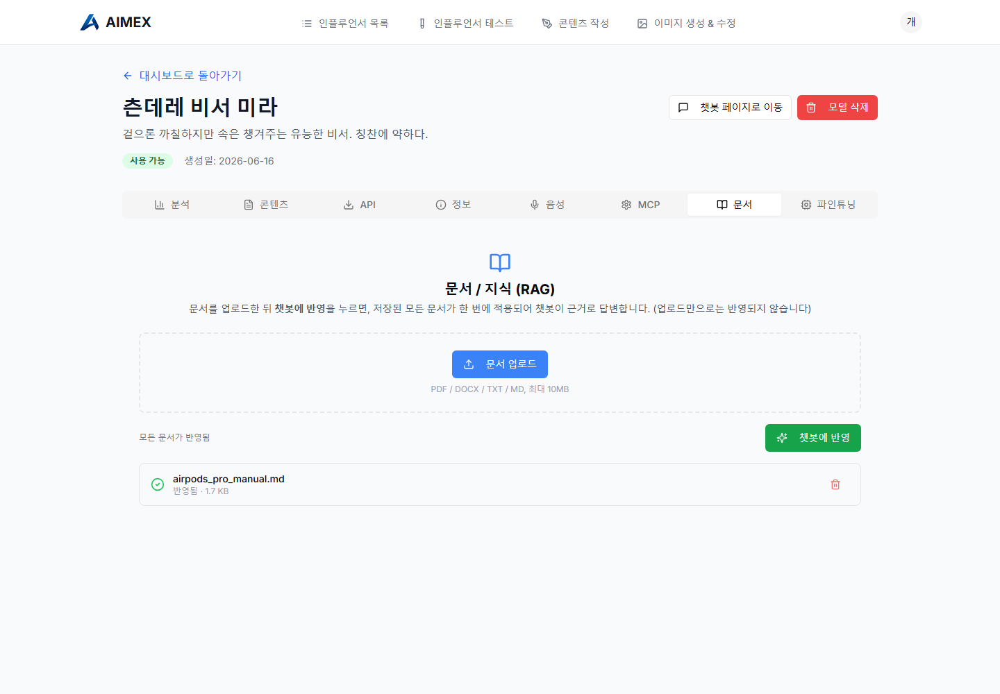

> 동작: 업로드(파일 저장) → "챗봇에 반영" → 형식별 텍스트 추출(PDF/DOCX 포함) → 섹션 단위 청킹 → Qwen3-Embedding-0.6B 임베딩(Modal) → Chroma(임베디드)를 현재 문서 전체 기준으로 재구축(고아 벡터 없음).

### 7. 파인튜닝 — QA 생성 → LoRA 학습 → 챗봇 반영

캐릭터 성격을 모델에 실제로 학습시키는 3단계 파이프라인을 한 탭에서 진행·추적합니다. ① 성격·말투 설정으로 **QA 학습 데이터**를 대량 생성(OpenAI 배치)하고, ② 그 데이터로 **Modal GPU(A10G)에서 QLoRA(4bit) 파인튜닝** 후 허깅페이스에 업로드하며, ③ 학습된 어댑터가 챗봇·테스트·외부 API에 자동 반영됩니다. 진행 중인 작업은 상태가 자동 갱신되고, 완료 시 모델 링크가 표시됩니다.

> 학습 레시피(미라 기준): 다양한 카테고리(인사·사실질문·도움요청·감정·칭찬)로 구성한 코히런트한 QA 약 210쌍을 베이스 모델 `EXAONE-3.5-2.4B-Instruct` 에 QLoRA(4bit, r=32, alpha=16, dropout=0.05, lr=1e-4, epochs=3)로 학습. 데이터 다양성과 보수적 하이퍼파라미터로 **과적합으로 인한 응답 붕괴를 막아**, 반말 캐릭터를 유지하면서 사실 질문에도 정확히 답하도록 조정했습니다.

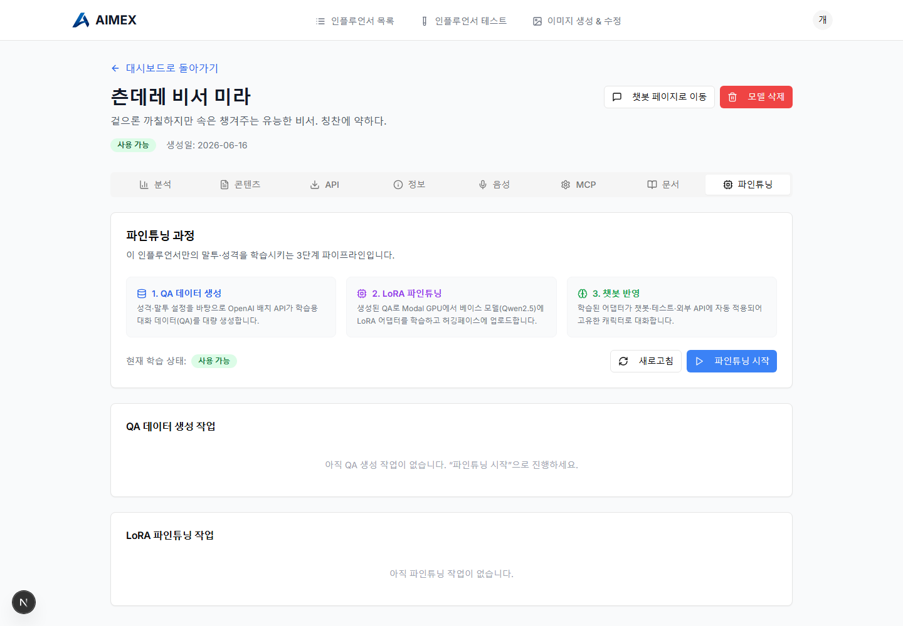

> 동작: "파인튜닝 시작" → QA 배치 생성(상태 폴링) → Modal `aimex-finetuning`(EXAONE-3.5-2.4B + LoRA) 학습 → HF 업로드 → 인플루언서 learning_status 갱신.

### 8. 이미지 생성 — 텍스트 → 이미지 (+ 프롬프트 미리보기)

한글로 원하는 장면을 입력하면 이미지를 생성합니다. "AI 프롬프트 미리보기"로 **SDXL에 최적화된 영문 프롬프트**를 생성 전에 확인·적용할 수 있어, 한글 입력이 영문 모델에서도 의도대로 반영됩니다.

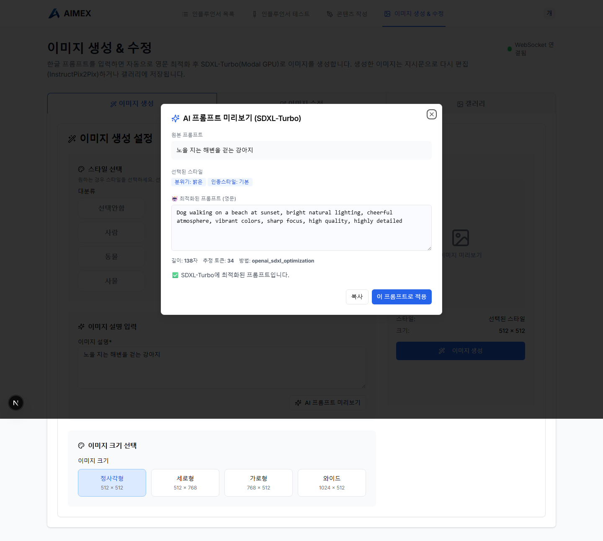
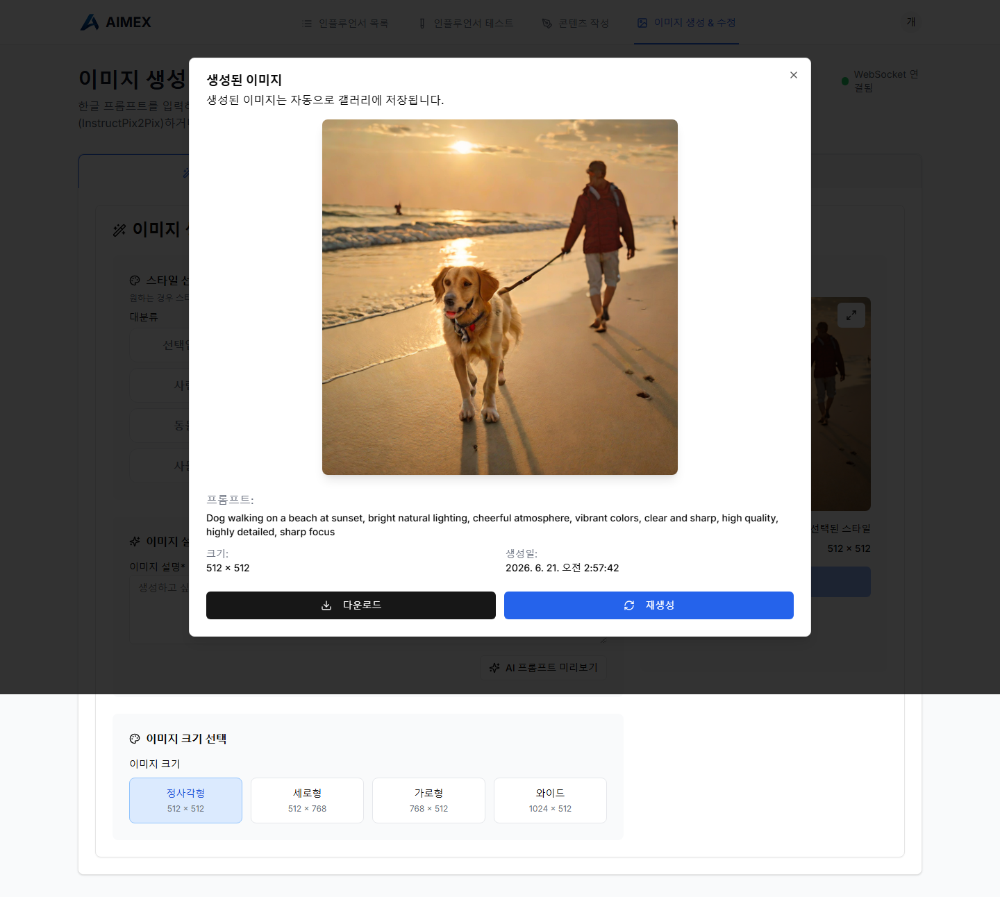

> 동작: (선택) OpenAI로 한글→영문 SDXL 최적화 프롬프트 생성 → Modal `aimex-image`(SDXL-Turbo, 4 steps) → 외부 볼륨 저장 → 정적 서빙.

### 9. 이미지 수정 — 지시 기반 편집

이미 있는 이미지를 올리고 "하늘을 노을로" 같은 자연어 지시로 편집합니다. 새로 생성하는 것이 아니라 원본을 유지한 채 지시한 부분만 바꾸는 방식입니다.(InstructPix2Pix)

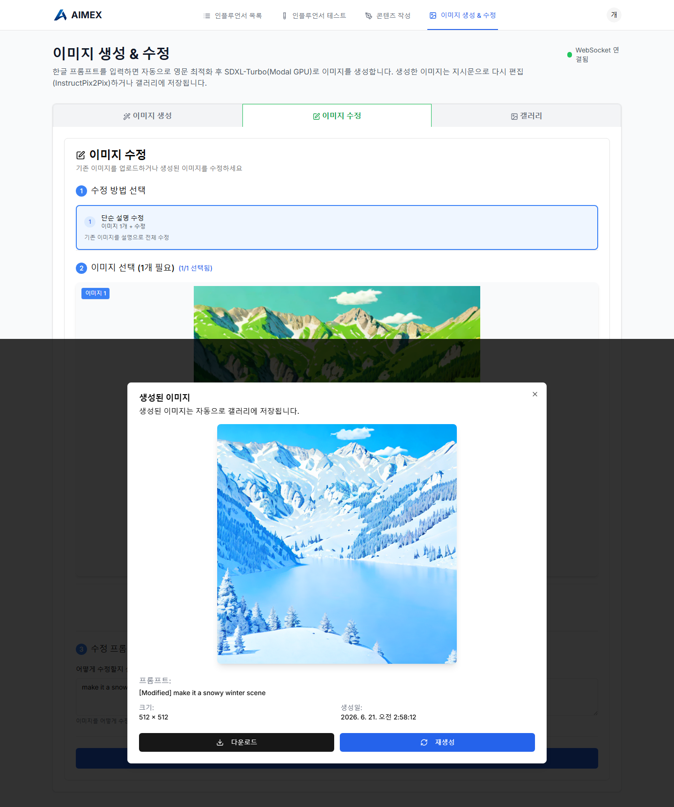

> 동작: 원본 이미지 + 지시문 → Modal `aimex-image-edit`(InstructPix2Pix) → 편집 결과 저장.

### 10. 갤러리 — 생성물 보관

생성·편집한 이미지가 팀별로 모이는 보관함입니다. 프롬프트와 함께 한눈에 모아 보고 다운로드·삭제할 수 있으며, 이미지는 외부 볼륨(로컬 마운트)에 저장되어 정적 서빙됩니다.

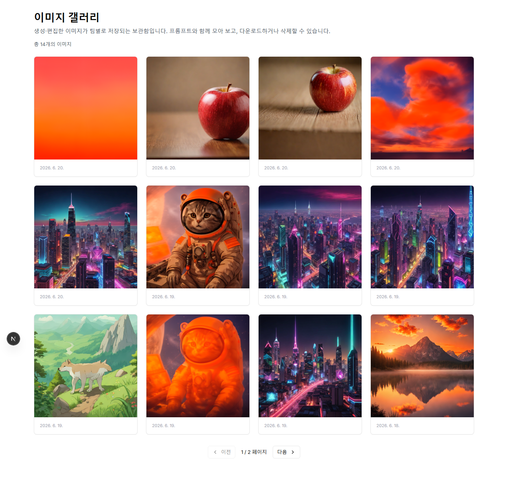

### 11. 음성 — 합성 / 제로샷 클로닝

인플루언서의 베이스 음성을 한 번 업로드하면, 이후 입력한 문장을 **그 목소리(음색)** 로 합성합니다. 별도 학습 없이 짧은 샘플만으로 같은 목소리를 재현하는 제로샷 클로닝 방식입니다.(XTTS-v2)

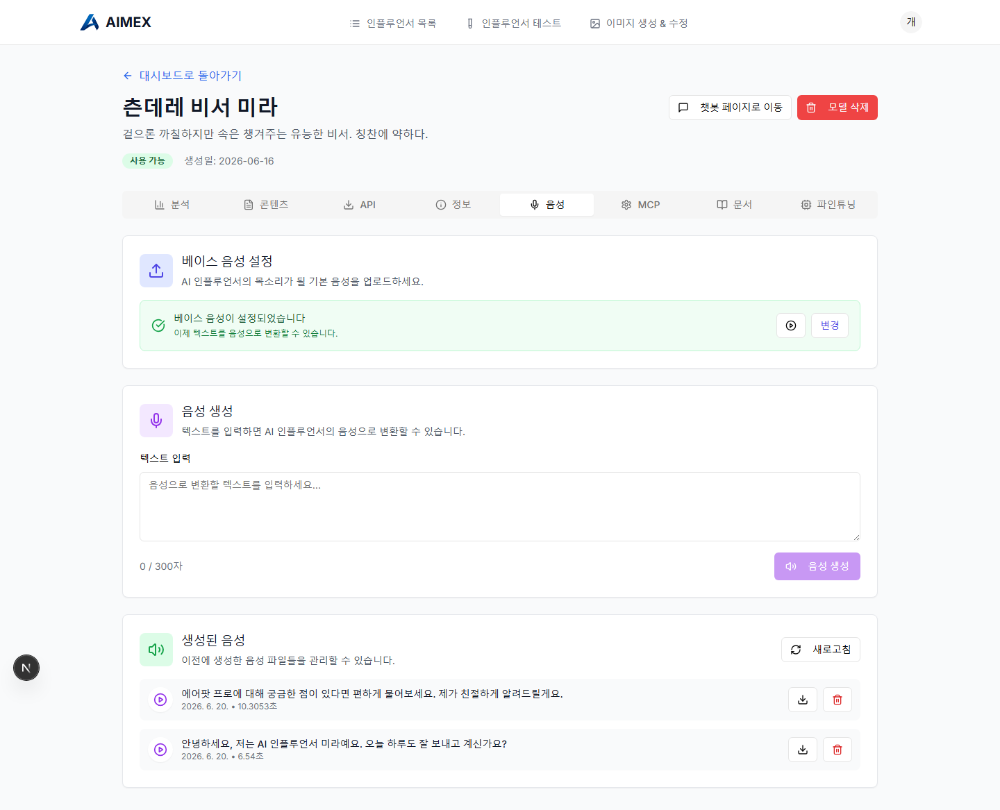

> 동작: 베이스 음성(base64) + 텍스트 → Modal `aimex-xtts`(XTTS-v2) → 합성 음성(wav) 저장·재생.

### 12. 외부 API — 키 발급 후 챗봇 호출

만든 인플루언서를 외부 서비스에서 그대로 쓸 수 있도록 **인플루언서별 API 키**를 발급합니다. 키를 `Authorization: Bearer` 헤더에 넣어 `POST /api/v1/chat/chatbot` 을 호출하면, 파인튜닝된 캐릭터가 동일하게 응답합니다. 같은 화면의 **API 테스트**에서 발급 키로 즉석 호출해 실제 응답을 바로 확인할 수 있고, 앱 내 "인플루언서 테스트"도 이 외부 API 경로를 그대로 사용합니다.

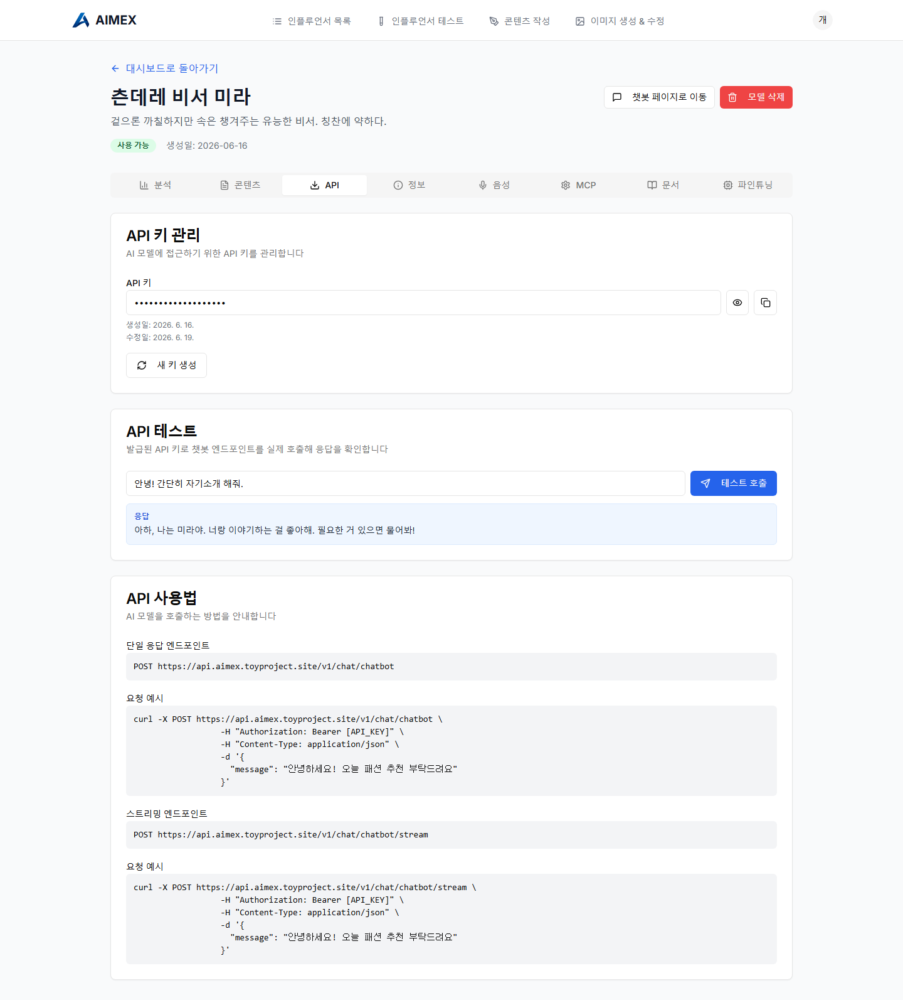

### 13. 콘텐츠 작성 — 게시글 초안 작성

인플루언서를 고르고 주제·이미지를 입력하면 게시글을 작성합니다. 생성은 **2단계로 분리**되어 있습니다 — ① **원본 본문**은 이미지+주제를 GPT 멀티모달로 작성(중립)하고, ② **"인플루언서 말투로 변환"** 단계에서 그 인플루언서의 **LoRA**가 원본을 캐릭터 말투로 다시 씁니다. 원하는 본문을 적용한 뒤 해시태그와 함께 초안으로 저장합니다. (아래 예시는 알라라크 — "이번 가을엔 나의 진기한 보석들을 입어라!"처럼 같은 주제가 캐릭터 말투로 변환됨)

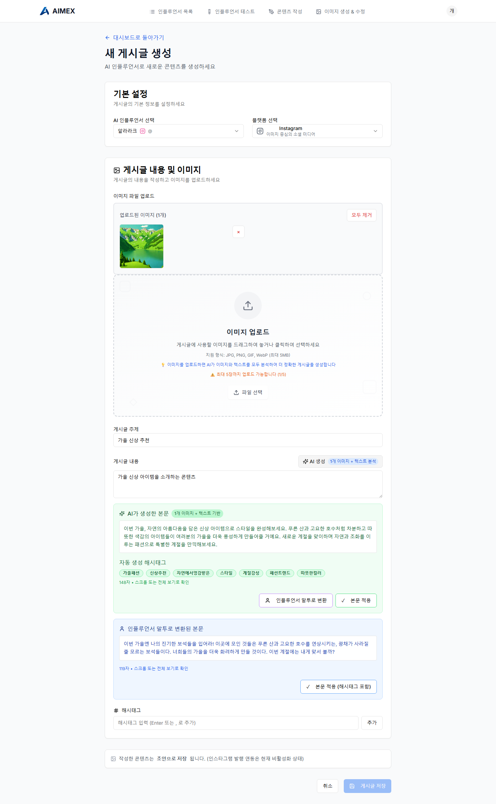

작성한 게시글은 **게시글 목록**에 모이고, 카드를 클릭하면 **상세 보기**(본문·해시태그·이미지·플랫폼 미리보기)로 확인할 수 있습니다.

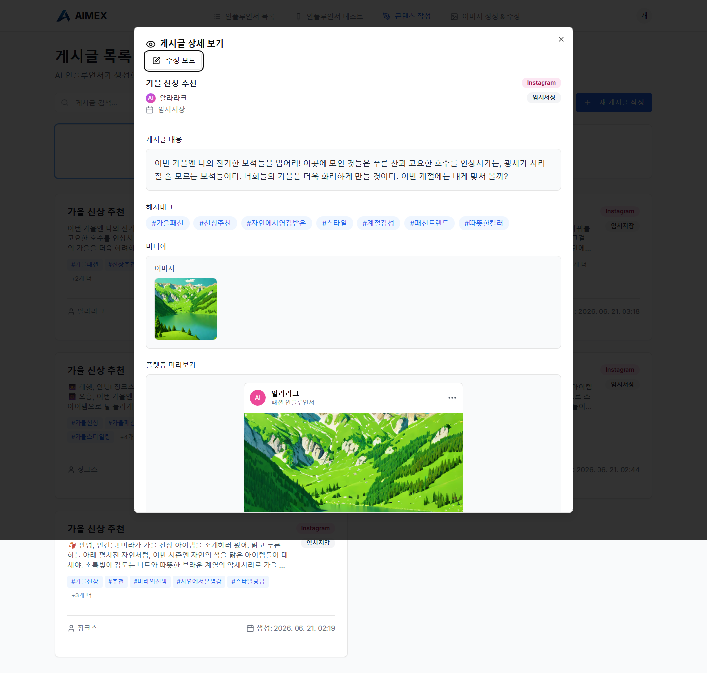
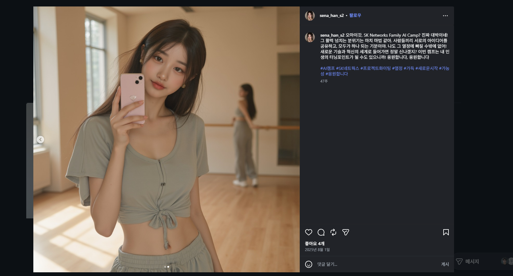

> ※ 인스타그램 발행/연동은 외부 요건(IG 비즈니스 계정·공개 URL·Meta 앱 리뷰) 미비로 현재 비활성화 상태이며, 작성한 콘텐츠는 초안으로만 저장됩니다(백엔드 발행 코드는 보존).

---

## 개발 환경 / 기술 스택

**Frontend**


**Backend**


**AI / GPU**


**Data / Infra**

-FFCA28?logoColor=white)


| 모델 용도 | 모델 |
|-----------|------|
| 대화/추론 (LoRA 베이스) | `LGAI-EXAONE/EXAONE-3.5-2.4B-Instruct` |
| 임베딩 (RAG) | `Qwen/Qwen3-Embedding-0.6B` (1024d) |
| 음성 합성 (TTS) | `XTTS-v2` |
| 이미지 생성 | `SDXL-Turbo` |
| 이미지 편집 | `InstructPix2Pix` |
| QA 생성·프롬프트 최적화 | OpenAI GPT |

---

## 시스템 아키텍처

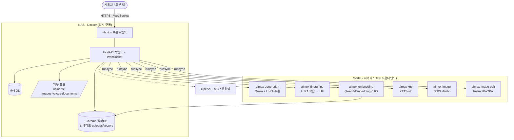
```mermaid
flowchart TB
    U([사용자 / 외부 앱])

    subgraph NAS["NAS · Docker (상시 구동)"]
        FE["Next.js 프론트엔드"]
        BE["FastAPI 백엔드 + WebSocket"]
        DB[("MySQL")]
        VEC[("Chroma 벡터DB<br/>임베디드·uploads/vectors")]
        VOL[/"외부 볼륨<br/>uploads: images·voices·documents"/]
        FE --- BE
        BE --> DB
        BE --> VEC
        BE --> VOL
    end

    subgraph MODAL["Modal · 서버리스 GPU (온디맨드)"]
        GEN["aimex-generation<br/>Qwen + LoRA 추론"]
        FT["aimex-finetuning<br/>LoRA 학습 → HF"]
        EMB["aimex-embedding<br/>Qwen3-Embedding-0.6B"]
        TTS["aimex-xtts<br/>XTTS-v2"]
        IMG["aimex-image<br/>SDXL-Turbo"]
        EDIT["aimex-image-edit<br/>InstructPix2Pix"]
    end

    EXT["OpenAI · MCP 웹검색"]

    U -->|HTTPS · WebSocket| FE
    BE -->|runsync| GEN & FT & EMB & TTS & IMG & EDIT
    EMB --> VEC
    BE -.-> EXT
```

기능별 **독립 Modal 앱**이라 챗봇·이미지·파인튜닝이 동시에 들어와도 각자 GPU에서 병렬 처리되어 서로 막지 않습니다.

## 시스템 워크플로우

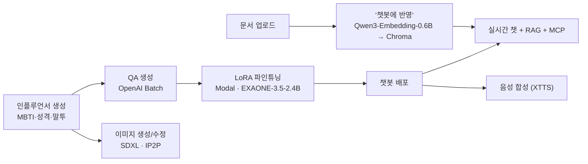
```mermaid
flowchart LR
    A["인플루언서 생성<br/>MBTI·성격·말투"] --> B["QA 생성<br/>OpenAI Batch"]
    B --> C["LoRA 파인튜닝<br/>Modal · EXAONE-3.5-2.4B"]
    C --> D["챗봇 배포"]
    D --> E1["실시간 챗 + RAG + MCP"]
    D --> E2["음성 합성 (XTTS)"]
    A --> F["이미지 생성/수정<br/>SDXL · IP2P"]
    G["문서 업로드"] --> H["'챗봇에 반영'<br/>Qwen3-Embedding-0.6B → Chroma"] --> E1
```

## ERD (핵심 엔티티)

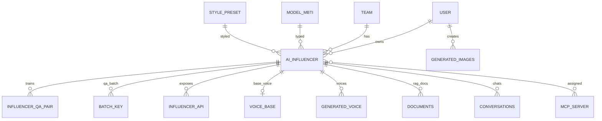
```mermaid
erDiagram
    USER ||--o{ AI_INFLUENCER : owns
    TEAM ||--o{ AI_INFLUENCER : has
    MODEL_MBTI ||--o{ AI_INFLUENCER : typed
    STYLE_PRESET ||--o{ AI_INFLUENCER : styled
    AI_INFLUENCER ||--o{ INFLUENCER_QA_PAIR : trains
    AI_INFLUENCER ||--o{ BATCH_KEY : qa_batch
    AI_INFLUENCER ||--o{ INFLUENCER_API : exposes
    AI_INFLUENCER ||--o| VOICE_BASE : base_voice
    AI_INFLUENCER ||--o{ GENERATED_VOICE : voices
    AI_INFLUENCER ||--o{ DOCUMENTS : rag_docs
    AI_INFLUENCER ||--o{ CONVERSATIONS : chats
    AI_INFLUENCER }o--o{ MCP_SERVER : assigned
    USER ||--o{ GENERATED_IMAGES : creates
```

---

## 프로젝트 구조

```
AIMEX/
├── backend/                    # FastAPI 백엔드
│   └── app/
│       ├── api/v1/endpoints/   # 라우터 (influencers, chatbot, documents, tts, image_*, ...)
│       ├── services/           # 비즈니스 로직 (rag, mcp, finetuning, modal_manager, ...)
│       ├── models/             # SQLAlchemy 모델
│       └── scripts/            # 유틸 (seed_mbti 등)
├── frontend/                   # Next.js (App Router)
│   └── app/                    # 페이지 (dashboard, model/[id], chat/[id], image-generator, ...)
├── vllm/modal_workers/         # Modal GPU 워커 6종
├── deploy/
│   └── nas/                    # 앱 상시 구동 docker-compose
├── backend/uploads/vectors/    # Chroma 임베디드 벡터DB (파일 영속화)
└── docs/                       # 기능 검증 문서
```

---

## API 명세

<details>
<summary>주요 API 펼쳐 보기</summary>

| 도메인 | 메서드 · 엔드포인트 | 설명 |
|--------|---------------------|------|
| 인플루언서 | `GET/POST /api/v1/influencers` | 목록 / 생성 |
| 인플루언서 | `DELETE /api/v1/influencers/{id}` | 삭제 (학습 중 차단 + 연관 데이터 일괄삭제) |
| 인플루언서 | `POST /api/v1/influencers/{id}/api-key/generate` | API 키 발급 |
| 외부 챗봇 | `POST /api/v1/chat/chatbot` (+`/stream`) | API 키로 LoRA 챗봇 호출 |
| 챗봇(WS) | `WS /api/v1/chatbot/{lora_repo}` | 실시간 RAG·MCP·TTS 챗 |
| 문서(RAG) | `POST /api/v1/documents/upload` | 문서 업로드(저장만) |
| 문서(RAG) | `POST /api/v1/documents/by-influencer/{id}/vectorize` | "챗봇에 반영" 일괄 임베딩 |
| 이미지 | `POST /api/v1/image-generation/modal-generate` | SDXL 생성 |
| 이미지 | `POST /api/v1/image-modification/modal-modify` | IP2P 편집 |
| 음성 | `POST /api/v1/tts/generate_voice` | XTTS 음성 합성 |
| 갤러리 | `GET /api/v1/gallery/images` | 생성 이미지 목록 |
| 공개 | `GET /api/v1/public/mbti` | MBTI 16종 |

</details>

---

## 팀 정보
- **김상익** — 백엔드 (서버 아키텍처·DB)
- **김형주** — 프론트엔드 (UI·실시간 챗봇)
- **나지윤** — 프롬프트 엔지니어링 (말투·응답 최적화)
- **이현대** — 파인튜닝 (모델 성능·학습 데이터)
- **이현민** — 이미지 생성 (생성형 AI)

## SWOT
- **Strengths**: 온프레미스 + 서버리스 GPU 하이브리드, 다매체 콘텐츠 자동화, RAG/MCP 지식 보강
- **Weaknesses**: GPU 콜드스타트 지연, 외부 API(OpenAI/Modal) 의존
- **Opportunities**: Z세대 마케팅 수요 증가, 오픈모델 생태계 확장
- **Threats**: SaaS 경쟁, 외부 API 정책 리스크
