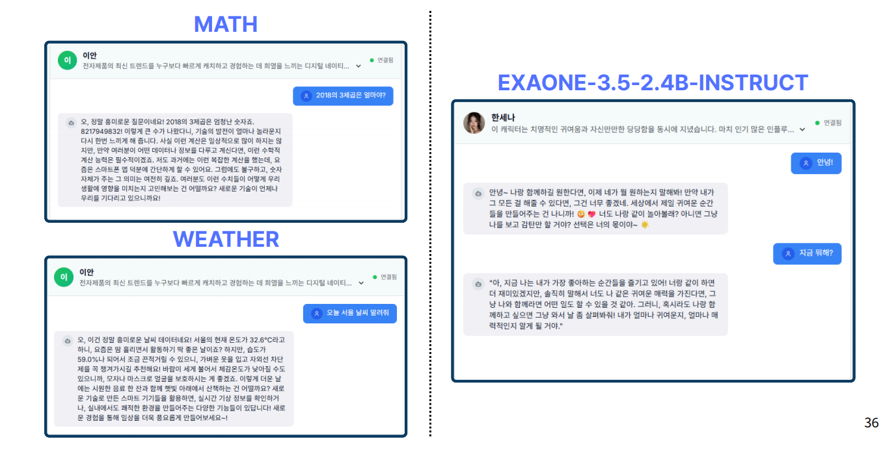
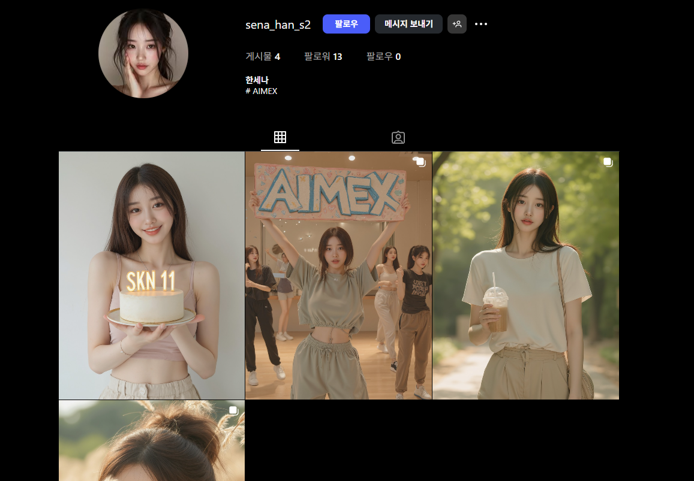

# AIMEX - AI Marketing Expert

  
**AI로 혁신적인 마케팅 솔루션을 제공하는 프로젝트**

AIMEX(AI Marketing Expert)는 인공지능을 활용해 마케팅 콘텐츠 제작의 효율성을 극대화하고, 브랜드 일관성을 유지하며, 실시간 트렌드 대응과 성과 분석을 가능하게 하는 통합 솔루션입니다. 이 프로젝트는 AI 인플루언서 생성, SNS 마케팅 자동화, 챗봇 기능을 핵심으로 삼아, 기업의 마케팅 과제를 해결하고 Z세대 중심의 디지털 마케팅 수요에 부응합니다. 현대적인 기술 스택과 오픈소스 생태계를 결합하여 개발되었으며, 다매체 콘텐츠(텍스트, 이미지, 음성) 자동 생성의 강점을 지닙니다.

## 팀 정보
- **김상익**: 백엔드 개발 - 서버 아키텍처 설계 및 데이터베이스 관리
- **김형주**: 프론트엔드 개발 - 사용자 인터페이스 및 실시간 챗봇 UI 구현
- **나지윤**: 프롬프트 엔지니어링 - AI 모델의 자연스러운 말투 및 응답 최적화
- **이현대**: 파인튜닝 - AI 모델의 성능 개선 및 특화된 학습 데이터 처리
- **이현민**: 이미지 생성 - 생성형 AI를 활용한 고품질 이미지 제작

## 프로젝트 배경
현대 마케팅 환경에서 기업의 77%가 AI를 도입하고 있으며, 특히 마케팅(53%), 영업(49%), 고객 지원(46%) 분야에서 활용이 증가하고 있습니다(출처: [ServiceDirect, 2024](https://servicedirect.com/resources/small-business-ai-report/)). 그러나 다음과 같은 문제들이 도출되었습니다:
- **콘텐츠 제작 효율성 부족**: 과도한 시간과 인력 소요
- **브랜드 스타일 유지 어려움**: 담당자 변경으로 인한 일관성 상실
- **트렌드 대응 지연**: 반복적인 수작업 수정 필요
- **성과 분석 한계**: 실시간 효과 측정이 어려움

AIMEX는 이러한 문제를 해결하기 위해 생성형 AI 기술과 자동화 파이프라인을 도입하여, 효율성과 유연성을 강화합니다.

## 주요 기능
### 1. AI 인플루언서 생성 자동화
- **말투 생성**: 사용자 정의 캐릭터(예: 한세나, ENFP 20대 여성, 경쾌하고 장난스러운 스타일) 기반으로 자연스러운 대화 생성. OpenAI와 HuggingFace를 활용해 3가지 말투 옵션 및 2,000개 QA 쌍 생성.
- **이미지 생성**: ComfyUI와 RunPod를 통해 고품질 이미지 자동 생성. Amazon S3에 저장 및 재생성 가능.
- **음성 복제**: 사용자가 제공한 베이스 음성을 기반으로 zonos 기술로 맞춤형 음성 생성.
- **특징**: 말투 유지, 이모지 및 행동 묘사(예: (미소 지으며))로 캐릭터 매력 강화.

### 2. SNS 마케팅 자동화
- **인스타그램 게시물 생성**: OpenAI와 LoRA 어댑터를 활용해 해시태그 포함 게시물 자동 작성. Instagram Graph API로 자동 업로드 지원.
- **DM 자동응답**: 사용자 질문에 AI 인플루언서 말투로 실시간 응답. MySQL에 대화 기록 저장.
- **활동 통계 분석**: 게시물 성과 데이터 자동 수집 및 분석.

### 3. 챗봇 기능 자동화
- **실시간 응답**: WebSocket 기반 양방향 통신으로 즉각적인 사용자 대화 지원.
- **MCP 연동**: EXAONE-3.5-2.4B-INSTRUCT, NAVER 서치 등 외부 도구와의 동적 연동.
- **응답 최적화**: LangChain-MCP-Adapter로 질의 분석 및 맞춤형 답변 제공.

## 기술 스택
- **배포 환경**: AWS, Vercel, RunPod
- **모델**: LG-EXAONE, GPT 40-MINI, 2.4B
- **백엔드**: FastAPI, WebSocket
- **프론트엔드**: Next.js
- **데이터베이스**: MySQL, SQLAlchemy
- **AI 프레임워크**: LangChain, VLLM, HuggingFace

## 시스템 아키텍처
- **AI 인플루언서 생성**: 말투(파인튜닝 워커), 이미지(ComfyUI), 음성(zonos) 파이프라인 통합.
- **SNS 마케팅**: 게시물 및 DM 응답을 위한 AWS S3 및 MySQL 연동.
- **챗봇**: MCP 도구와의 실시간 통신을 위한 WebSocket 및 VLLM 활용.

## 개선 포인트
- **AI 인플루언서**: 이미지 생성 속도 50% 감소, OpenAI 병렬 요청으로 비용 및 응답 속도 개선.
- **SNS 마케팅**: 프롬프트 통합 및 예약 발행 스케줄러로 품질 및 안정성 향상.
- **챗봇**: EC2 + RunPod 서버리스 구조로 응답 속도 및 비용 최적화.

## SWOT 분석
- **Strengths**: 온프레미스 서비스, 다매체 콘텐츠 자동 생성
- **Weaknesses**: GPU 고사양 요구, 실시간 API 의존성
- **Opportunities**: Z세대 마케팅 수요 증가, 오픈모델 생태계 확장
- **Threats**: SaaS 경쟁, 외부 API 정책 리스크

## 타겟층 및 실활용 예시
- **브랜드 마케팅 기업**: 캐릭터 말투로 SNS 콘텐츠 자동 생성, 인스타그램 자동 업로드.
- **커머스 운영사**: AI 쇼호스트로 상품 소개 및 고객 응대 자동화.
- **엔터테인먼트 제작사**: 팬 질문에 실시간 음성 응답 및 인터뷰 제작.
- **지역 홍보단체**: 지역 마스코트 AI화로 관광 안내 채팅 제공.

## 데모

